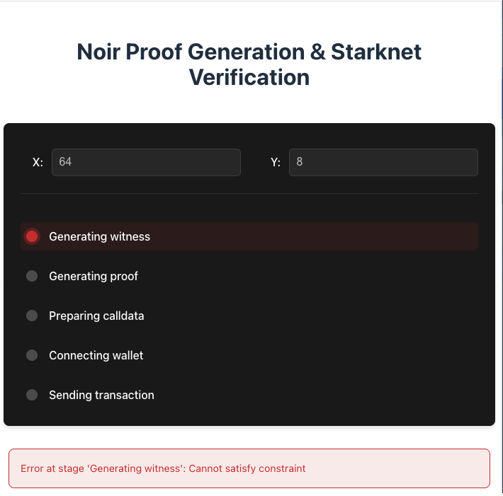

# Task5: 实现x!=y的2次方证明并在Testnet完成这一简单证明，提交GitHub链接，链接内包含实现的代码


## 实现代码

circuit/src/main.nr

```
fn main(x: Field, y: pub Field) {
    assert(x != y * y);
}
```

## 编译Noir电路
```
cd circuit && nargo build
```

## 执行电路生成见证
```
cd circuit && nargo execute witness
[circuit] Circuit witness successfully solved
[circuit] Witness saved to target/witness.gz
```

## 生成验证密钥
```
bb write_vk --scheme ultra_honk --oracle_hash starknet -b ./circuit/target/circuit.json -o ./circuit/target
Scheme is: ultra_honk, num threads: 12
VK saved to "./circuit/target/vk"
```

## 使用 Garaga 在 Cairo 生成验证者合约
```
cd contracts && garaga gen --system ultra_starknet_honk --vk ../circuit/target/vk --project-name verifier
⠦ Generating Smart Contract project for ProofSystem.UltraStarknetHonk using vk...
Done!
Smart Contract project created:
/starknet-scaffold-garaga/contracts/verifier/
├── .tool-versions
├── Scarb.lock
├── Scarb.toml
└── src/
    ├── honk_verifier.cairo
    ├── honk_verifier_circuits.cairo
    ├── honk_verifier_constants.cairo
    └── lib.cairo
```

## 创建账号并部署

```bash
sncast account create \
	--network sepolia \
	--name js

sncast account deploy \
    --network sepolia \
    --name js
```

## 声明合约代码
```
sncast declare --contract-name UltraStarknetHonkVerifier --url https://starknet-sepolia.public.blastapi.io/rpc/v0_8

command: declare
error: Transaction execution error = TransactionExecutionErrorData { transaction_index: 0, execution_error: Message("Class with hash 0x004d13e14caa3b225b07595e7edcade77ce849e30ee7908bf4b2e4446d652ebf is already declared.") }
```

## 部署验证器
```
sncast deploy --salt 0x9a5d6dba9ebc3e25 --class-hash 0x004d13e14caa3b225b07595e7edcade77ce849e30ee7908bf4b2e4446d652ebf --url https://starknet-sepolia.public.blastapi.io/rpc/v0_8
command: deploy
contract_address: 0x014b18c62eb5beed00ee33f6309b4c766cab59d17be6915b57b3da392d07e9ac
transaction_hash: 0x0110880107b8d678228028f424ca889ac054f5447da5c76b16e6a26670d2ded6

To see deployment details, visit:
contract: https://sepolia.starkscan.co/contract/0x014b18c62eb5beed00ee33f6309b4c766cab59d17be6915b57b3da392d07e9ac
transaction: https://sepolia.starkscan.co/tx/0x0110880107b8d678228028f424ca889ac054f5447da5c76b16e6a26670d2ded6
```

## 拷贝必要文件到前端
```
cp ./circuit/target/circuit.json ./app/src/assets/circuit.json
cp ./circuit/target/vk ./app/src/assets/vk.bin
cp ./contracts/target/release/verifier_UltraStarknetHonkVerifier.contract_class.json ./app/src/assets/verifier.json
```

## 启动前端

```
$ bun add -d typescript@next
$ bun add vite
$ bun run build
$ bun run dev
```

## 效果展示


